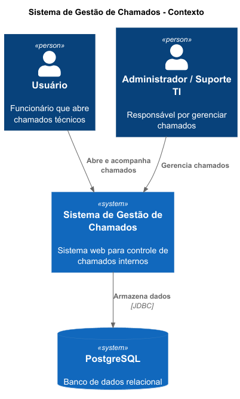
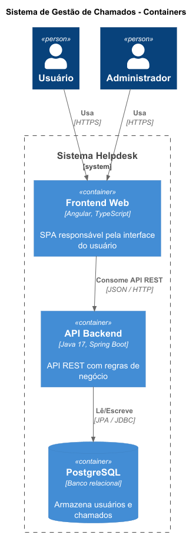
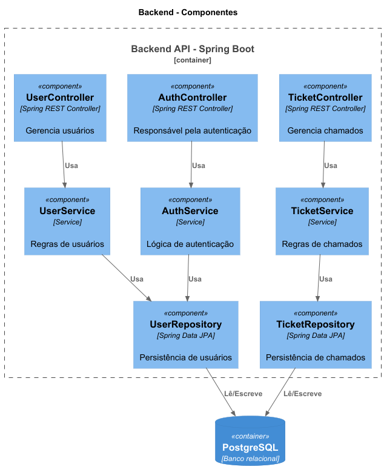

# Sistema de Gestão de Chamados (Help Desk)

## 1. Domínio do Problema

Empresas frequentemente enfrentam dificuldades no gerenciamento de chamados técnicos internos, como problemas de rede, computadores, sistemas e acessos.

Quando não há um sistema estruturado, podem ocorrer:

- Perda de solicitações
- Falta de priorização adequada
- Atraso no atendimento
- Ausência de histórico de ocorrências

O sistema proposto centraliza e organiza os chamados técnicos internos, proporcionando controle, rastreabilidade e melhor gestão do suporte, incluindo acompanhamento completo do ciclo de vida do chamado.

---

## 2. Objetivo do Sistema

- Cadastro de usuários com diferentes perfis de acesso
- Abertura de chamados técnicos
- Definição de prioridade e categorização
- Acompanhamento de status do chamado
- Registro de responsável pelo atendimento
- Histórico de atendimentos com interações (comentários)
- Controle administrativo

---

## 3. Arquitetura do Sistema

### Visão de Contexto



### Visão de Containers



### Visão de Componentes (Backend)



---

## 4. Requisitos Funcionais (RF)

- **RF01** – O sistema deve permitir cadastro de usuários.
- **RF02** – O sistema deve permitir autenticação de usuários.
- **RF03** – O usuário deve poder abrir um chamado.
- **RF04** – O administrador deve poder alterar o status do chamado.
- **RF05** – O sistema deve listar chamados por prioridade.
- **RF06** – O sistema deve registrar data e responsável pelo atendimento.
- **RF07** – O sistema deve permitir registrar comentários em chamados.

---

## 5. Requisitos Não Funcionais (RNF)

- **RNF01** – O sistema deve utilizar arquitetura REST.
- **RNF02** – O sistema deve utilizar autenticação JWT.
- **RNF03** – O sistema deve utilizar banco de dados relacional PostgreSQL com integridade referencial.
- **RNF04** – O frontend deve ser SPA (Single Page Application).
- **RNF05** – O sistema deve possuir responsividade básica.
- **RNF06** – O código deve seguir padrão MVC.

---

## 6. Principais Tecnologias

### Backend

| Tecnologia | Versão | Função |
|---|---|---|
| Java | 17 | Linguagem principal |
| Spring Boot | 4.0.3 | Framework base / REST |
| Spring Data JPA | — | Persistência / ORM |
| Spring Security | — | Autenticação e autorização |
| JJWT | 0.12.6 | Geração e validação de tokens JWT |
| Hibernate | — | Mapeamento objeto-relacional |
| Lombok | — | Redução de boilerplate |
| Springdoc OpenAPI | 2.8.8 | Documentação automática (Swagger UI) |
| PostgreSQL | — | Banco de dados relacional |
| Gradle | — | Build e gerenciamento de dependências |

### Frontend

| Tecnologia | Função |
|---|---|
| Angular 18+ | Framework SPA |
| TypeScript | Tipagem estática |
| Bootstrap / Material | Componentes de UI |

---

## 7. Estrutura do Projeto

```
helpdesk-java-angular/
│
├── README.md
│
├── backend/
│   └── helpdesk/
│       │
│       ├── src/
│       │   ├── main/
│       │   │   ├── java/com/murilo/helpdesk/
│       │   │   │   ├── HelpdeskApplication.java
│       │   │   │   │
│       │   │   │   ├── model/
│       │   │   │   │   ├── Usuario.java
│       │   │   │   │   ├── Chamado.java
│       │   │   │   │   ├── Comentario.java
│       │   │   │   │   ├── Anexo.java
│       │   │   │   │   ├── Avaliacao.java
│       │   │   │   │   ├── HistoricoChamado.java
│       │   │   │   │   ├── DepartamentoEntity.java
│       │   │   │   │   └── enums/
│       │   │   │   │       ├── Perfil.java
│       │   │   │   │       ├── Status.java
│       │   │   │   │       ├── Prioridade.java
│       │   │   │   │       ├── Categoria.java
│       │   │   │   │       ├── Severidade.java
│       │   │   │   │       └── Departamento.java
│       │   │   │   │
│       │   │   │   ├── repository/
│       │   │   │   │   ├── UsuarioRepository.java
│       │   │   │   │   ├── ChamadoRepository.java
│       │   │   │   │   ├── ComentarioRepository.java
│       │   │   │   │   ├── AnexoRepository.java
│       │   │   │   │   ├── AvaliacaoRepository.java
│       │   │   │   │   ├── DepartamentoRepository.java
│       │   │   │   │   └── HistoricoChamadoRepository.java
│       │   │   │   │
│       │   │   │   ├── service/
│       │   │   │   │   ├── UsuarioService.java
│       │   │   │   │   └── ChamadoService.java
│       │   │   │   │
│       │   │   │   └── controller/
│       │   │   │       ├── UsuarioController.java
│       │   │   │       └── ChamadoController.java
│       │   │   │
│       │   │   └── resources/
│       │   │       └── application.properties
│       │   │
│       │   └── test/
│       │       └── java/com/murilo/helpdesk/
│       │           └── HelpdeskApplicationTests.java
│       │
│       ├── database/
│       │   ├── schema.sql
│       │   └── data.sql
│       │
│       ├── docs/architecture/
│       ├── build.gradle
│       ├── settings.gradle
│       └── gradlew
│
└── frontend/  (em desenvolvimento)
```

---

## 8. Endpoints da API

> Base URL: `http://localhost:9090/api/swagger-ui.html`

| Método | Endpoint | Descrição |
|---|---|---|
| GET | `/v1/usuarios` | Lista todos os usuários |
| GET | `/v1/usuarios/{id}` | Busca usuário por ID |
| POST | `/v1/usuarios` | Cria novo usuário |
| PUT | `/v1/usuarios/{id}` | Atualiza usuário |
| DELETE | `/v1/usuarios/{id}` | Remove usuário |
| GET | `/v1/chamados` | Lista chamados (paginado) |
| GET | `/v1/chamados/{id}` | Busca chamado por ID |
| POST | `/v1/chamados` | Abre novo chamado |
| PUT | `/v1/chamados/{id}` | Atualiza chamado |
| PATCH | `/v1/chamados/{id}/status/{status}` | Altera status do chamado |
| DELETE | `/v1/chamados/{id}` | Remove chamado |

Documentação interativa disponível em: `http://localhost:9090/api/swagger-ui.html`

---

## 9. Como configurar o banco de dados (PostgreSQL via Docker)

> **Pré-requisito:** [Docker Desktop](https://www.docker.com/products/docker-desktop/) instalado e em execução.  
> Funciona da mesma forma no **Windows 11** e no **Pop OS**.

### Subir o container do PostgreSQL

**Pop OS (terminal):**
```bash
docker run -d \
  --name helpdesk-db \
  -e POSTGRES_DB=helpdesk \
  -e POSTGRES_USER=postgres \
  -e POSTGRES_PASSWORD=postgres \
  -p 5432:5432 \
  postgres:16
```

**Windows 11 (PowerShell ou CMD):**
```cmd
docker run -d ^
  --name helpdesk-db ^
  -e POSTGRES_DB=helpdesk ^
  -e POSTGRES_USER=postgres ^
  -e POSTGRES_PASSWORD=postgres ^
  -p 5432:5432 ^
  postgres:16
```

> O `^` é a quebra de linha do Windows. Você também pode escrever tudo em uma linha só.

### Carregar o schema e os dados iniciais

**Pop OS:**
```bash
# Executar a partir da raiz do projeto
docker exec -i helpdesk-db psql -U postgres -d helpdesk < backend/helpdesk/database/schema.sql
docker exec -i helpdesk-db psql -U postgres -d helpdesk < backend/helpdesk/database/data.sql
```

**Windows 11 (PowerShell):**
```powershell
# Executar a partir da raiz do projeto
Get-Content backend\helpdesk\database\schema.sql | docker exec -i helpdesk-db psql -U postgres -d helpdesk
Get-Content backend\helpdesk\database\data.sql   | docker exec -i helpdesk-db psql -U postgres -d helpdesk
```

### Gerenciar o container

| Ação | Comando |
|---|---|
| Verificar se está rodando | `docker ps` |
| Parar | `docker stop helpdesk-db` |
| Reiniciar | `docker start helpdesk-db` |
| Ver logs | `docker logs helpdesk-db` |
| Remover | `docker rm -f helpdesk-db` |

### Pop OS — instalação nativa (sem Docker)

Caso prefira instalar o PostgreSQL diretamente no sistema:

```bash
sudo apt update && sudo apt install -y postgresql postgresql-contrib
sudo systemctl enable --now postgresql
sudo -u postgres psql -c "CREATE DATABASE helpdesk;"
sudo -u postgres psql -c "ALTER USER postgres WITH PASSWORD 'postgres';"
sudo -u postgres psql -d helpdesk < backend/helpdesk/database/schema.sql
sudo -u postgres psql -d helpdesk < backend/helpdesk/database/data.sql
```

---

## 10. Como executar o backend

**Pré-requisitos:** Java 21+, banco de dados rodando (seção 9), porta **9090** livre.

**Pop OS / Linux:**
```bash
cd backend/helpdesk
./gradlew bootRun
```

**Windows 11 (PowerShell ou CMD):**
```cmd
cd backend\helpdesk
gradlew.bat bootRun
```

Após iniciar:

| Recurso | URL |
|---|---|
| API REST | `http://localhost:9090/api` |
| Swagger UI | `http://localhost:9090/api/swagger-ui.html` |

---

## 11. Histórico de Melhorias

### build.gradle — Dependências adicionadas

O arquivo original continha apenas o `spring-boot-starter` básico, o que impedia o projeto de compilar e executar. Foram adicionados:

| Dependência | Motivo |
|---|---|
| `spring-boot-starter-web` | Habilita endpoints REST (`@RestController`, etc.) |
| `spring-boot-starter-data-jpa` | Habilita repositórios JPA e Hibernate |
| `spring-boot-starter-validation` | Habilita `@NotNull`, `@Size`, `@Email`, `@Valid` |
| `spring-boot-starter-security` | Base para autenticação e JWT |
| `jjwt-api/impl/jackson 0.12.6` | Geração e validação de tokens JWT |
| `postgresql` (runtimeOnly) | Driver JDBC para PostgreSQL |
| `lombok` (compileOnly + annotationProcessor) | Anotações como `@Data` e `@Builder` requerem o annotation processor |
| `springdoc-openapi-starter-webmvc-ui 2.8.8` | Swagger UI — as anotações `@Operation` já existiam nos controllers |
| `spring-security-test` | Suporte a testes com Spring Security |

### Estrutura de pacotes — Migração para o classpath

Todos os arquivos Java estavam em `backend/helpdesk/models/`, `repository/`, `service/` e `controller/` — fora da árvore de fontes do Gradle. O IDE não conseguia resolver imports e o projeto não compilava.

Todos os arquivos foram movidos para o caminho correto:
`backend/helpdesk/src/main/java/com/murilo/helpdesk/`

### Correções de bugs

| Arquivo | Bug | Correção |
|---|---|---|
| `Chamado.java` | Getters/setters com tipo `LocalDate` incorreto (campo é `LocalDateTime`) | Removidos — Lombok já os gera corretamente |
| `Usuario.java` | Faltava campo `departamento` exigido pelo `mappedBy` de `DepartamentoEntity` | Adicionado `@ManyToOne DepartamentoEntity departamento` |
| `HistoricoChamadoRepository.java` | Parâmetro `tipoAlteracao` era `String` em vez do enum `TipoAlteracao` | Corrigido para o tipo correto |
| `UsuarioService.java` | `@Autowired(required=false)` no `PasswordEncoder` — com Spring Security no classpath o bean sempre existe | Substituído por `@RequiredArgsConstructor` com injeção obrigatória |
| `UsuarioController.java` / `ChamadoController.java` | Path `/api/v1/...` + `context-path=/api` gerava `/api/api/v1/...` | Paths corrigidos para `/v1/...` |
| Todos os models | `@Data` sem customização em entidades JPA causa problemas de `equals`/`hashCode` com lazy loading | Adicionados `@EqualsAndHashCode(onlyExplicitlyIncluded=true)` e `@ToString(exclude={...})` em todas as entidades |

---

## 12. CI/CD — Integração e Entrega Contínua

O projeto utiliza **GitHub Actions** com dois pipelines independentes, acionados automaticamente em `push` e `pull_request` para a branch `main`.

### Pipeline do Backend (`ci-backend.yml`)

| Etapa | O que faz |
|---|---|
| Checkout | Clona o repositório |
| Setup JDK 21 | Configura o Java 21 (Temurin) |
| Cache Gradle | Reutiliza cache de dependências entre execuções |
| `./gradlew test` | Executa todos os testes unitários com H2 em memória |
| Publicar relatório | Sobe o relatório HTML de testes como artefato |
| `./gradlew build -x test` | Gera o JAR de produção |
| Publicar JAR | Disponibiliza o `.jar` como artefato para download |

> O pipeline usa banco **H2 em memória** para os testes — nenhuma dependência de PostgreSQL em CI.

### Pipeline do Frontend (`ci-frontend.yml`)

| Etapa | O que faz |
|---|---|
| Checkout | Clona o repositório |
| Setup Node 22 | Configura o Node.js com cache de `npm` |
| `npm ci` | Instala dependências de forma reproduzível |
| `npm run build` | Build de produção com Angular CLI |
| Publicar dist | Sobe os arquivos compilados como artefato |

### Localização dos arquivos de workflow

```
.github/
└── workflows/
    ├── ci-backend.yml   # Pipeline Java/Gradle
    └── ci-frontend.yml  # Pipeline Angular/Node
```

---

## 13. TDD — Testes Unitários

O projeto conta com **16 testes unitários** organizados em três classes, todos rodando sem Spring context (apenas Mockito + AssertJ), o que garante execução rápida.

### Estrutura dos testes

```
src/test/java/com/murilo/helpdesk/
├── service/
│   ├── UsuarioServiceTest.java   (6 testes)
│   └── ChamadoServiceTest.java   (6 testes)
└── security/
    └── JwtServiceTest.java       (4 testes)
```

### UsuarioServiceTest — 5 testes

| Teste | Cenário |
|---|---|
| `findById_quandoExiste_retornaUsuario` | Retorna entidade quando ID existe |
| `findById_quandoNaoExiste_lancaRuntimeException` | Lança exceção quando ID não existe |
| `create_comDadosValidos_retornaResponse` | Cria usuário e retorna DTO mapeado |
| `create_comEmailDuplicado_lancaRuntimeException` | Bloqueia cadastro com e-mail duplicado |
| `delete_quandoExiste_deletaSemExcecao` | Deleta usuário sem lançar exceção |
| `findAll_retornaListaMapeada` | Retorna lista de UsuarioResponse corretamente mapeada |

### ChamadoServiceTest — 6 testes

| Teste | Cenário |
|---|---|
| `findById_quandoNaoExiste_lancaRuntimeException` | Lança exceção quando chamado não existe |
| `findById_quandoExiste_retornaChamado` | Retorna entidade quando ID existe |
| `updateStatus_quandoEncerrado_setaDataFechamento` | Status ENCERRADO define `dataFechamento` |
| `updateStatus_emAndamento_naoSetaDataFechamento` | Status EM_ANDAMENTO não altera `dataFechamento` |
| `create_adminCriandoChamado_salvaChamado` | Admin cria chamado com status ABERTO |
| `delete_quandoNaoExiste_lancaRuntimeException` | Lança exceção e não chama `deleteById` |

### JwtServiceTest — 4 testes

| Teste | Cenário |
|---|---|
| `generateToken_retornaTokenNaoVazio` | Token gerado é não vazio e tem 3 partes (JWT) |
| `extractUsername_retornaUsernameCorreto` | Username extraído bate com o do token |
| `isTokenValid_comTokenCorreto_retornaVerdadeiro` | Validação retorna `true` para token correto |
| `isTokenValid_comOutroUsuario_retornaFalso` | Validação retorna `false` para usuário diferente |

### Configuração de teste

Os testes de serviço usam `@ExtendWith(MockitoExtension.class)` sem carregar o Spring context.  
O `JwtService` tem seus campos `@Value` injetados via `ReflectionTestUtils`.  
O `HelpdeskApplicationTests` (context loading) usa H2 em memória via `src/test/resources/application.properties`.

### Como executar

```bash
cd backend/helpdesk
./gradlew test 
ou
./gradlew cleanTest test --info
# Relatório HTML gerado em:
# build/reports/tests/test/index.html
```

---

## 14. Status do Projeto

| Componente | Status |
|---|---|
| Estrutura de pacotes | Corrigida |
| Dependências (build.gradle) | Corrigidas |
| Models e Enums | Completos |
| Repositories | Completos |
| Services (Usuario, Chamado) | Completos |
| Controllers (Usuario, Chamado) | Completos |
| Spring Security + JWT | Completo |
| DTOs (request/response) | Completos |
| Testes Unitários (TDD) | **16 testes unitários + 1 context test — Completos** |
| CI/CD (GitHub Actions) | **2 pipelines — Completos** |
| Frontend Angular | Em desenvolvimento |
